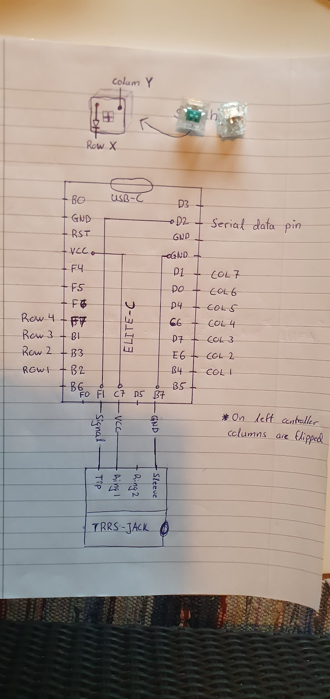

JD40 Split
======


Supported controller (tested) Atmega32u4 chip on Elite-c board

!Do not remove TRRS/TRS cable while powered up

## Build && flashing 
```
# Download jd40_split  
mkdir -p tempZXCQWE && cd tempZXCQWE
git clone https://github.com/d0rsha/jd40_split
# Download qmk firmware 
git clone https://github.com/qmk/qmk_firmware
# Copy config && cd 
cp jd40_split/ qmk_firmware/keyboards/handwired
rm -rf jd40_split
cd qmk_firmware
```
Connect left half. Edit your portmapping for the left side in `left/config.h` update the defined constants
```
MATRIX_ROW_PINS     # 
MATRIX_COL_PINS     # 
UNUSED_PINS         #
DIODE_DIRECTION     #
SOFT_SERIAL_PIN     # Communication pin
PRODUCT             # Product ID 
```
Build && Flash the left side 

> make handwired/jd40_split/`left`:d0rsha:dfu-split-`left`

Unlug left half and conntect right half. Edit your portmapping for the right side in `right/config.h` && update the above mentioned constants to match the right side. 
> make handwired/jd40_split/`right`:d0rsha:dfu-split-`right`

Enjoy! 


## Wiring scheme 

  
Wired colum to rows.  

------


------
### Links
[Good guide 1](http://www.masterzen.fr/2018/12/22/handwired-keyboard-build-log-part-2/)  
[Good guide 2](https://medium.com/@sachee/building-my-first-keyboard-and-you-can-too-512c0f8a4c5f)  
[QMK-doc on split keyboard](https://beta.docs.qmk.fm/features/feature_split_keyboard)  
Code is based on qmk_firmware/lets_split, https://github.com/qmk/qmk_firmware/tree/master/keyboards/lets_split  
[QMK-doc on keycodes](https://docs.qmk.fm/#/keycodes_basic)  
[QMK-doc HW config](https://docs.qmk.fm/#/hardware_avr)  
